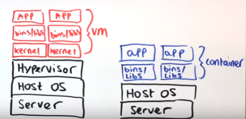
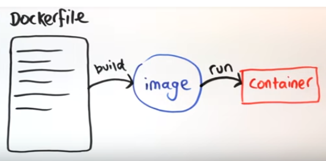

# samplejavadocker

- What is Docker
*Docker originally used LinuX Containers (LXC), but later switched to runC (formerly known as libcontainer), which runs in the same operating system as its host.
* With Docker you get less isolation, but the containers are lightweight (require fewer resources). So you could easily run thousands of containers on a host
*A full virtualized system usually takes minutes to start, whereas Docker/LXC/runC containers take seconds, and often even less than a second.
- Virtual Machine vs. Docker
	* VMvsDocker
	 
- Introduction to Dockerfiles, images and containers
   * Docketrfiles --"build" --to- "image" --"run"-to  "container"
   

- The Docker Hub

* https://hub.docker.com/
- Writing a Dockerfile
- Building an image
$ docker build -t my-php-app .
$ docker run -it --rm --name my-running-app my-php-app
- Running a container
docker run -it --rm --name my-running-app my-php-app
- Mounting volumes
 - One process per container / Container lifespan

 **Docker Compose

Docker Commpose is a tool for defining and running multi-container Docker applications.

define the services that make up your app in docker-compose.yml so they can be run together in an isolated environment.

get an app running in one command by just running docker-compose up
 
 
 **** Exemple :
 - https://github.com/romeOz/docker-apache-php
 -https://docs.microsoft.com/en-us/aspnet/mvc/overview/deployment/docker-aspnetmvc
 -http://containertutorials.com/docker-compose/flask-simple-app.html
 - http://containertutorials.com/docker-compose/get_started.html
